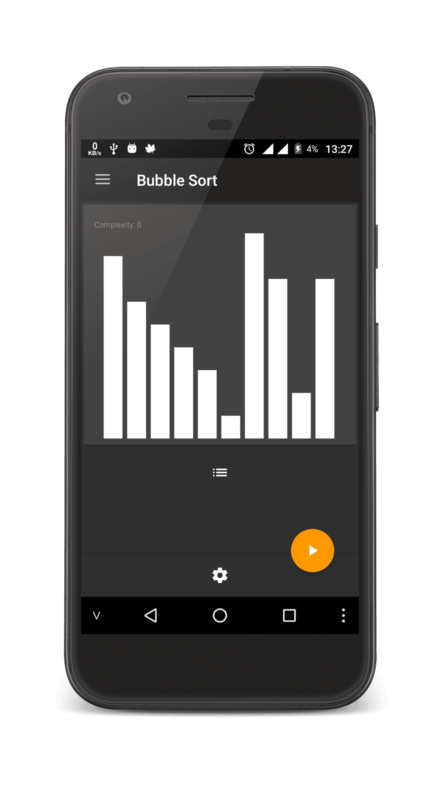
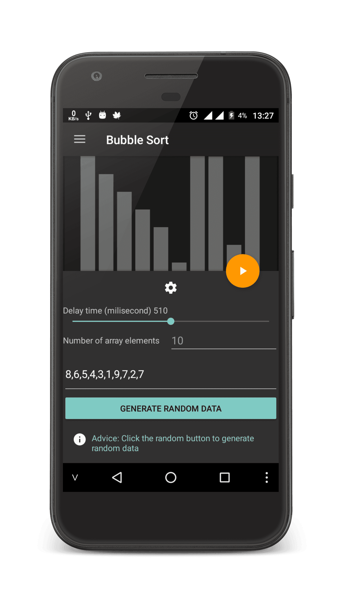
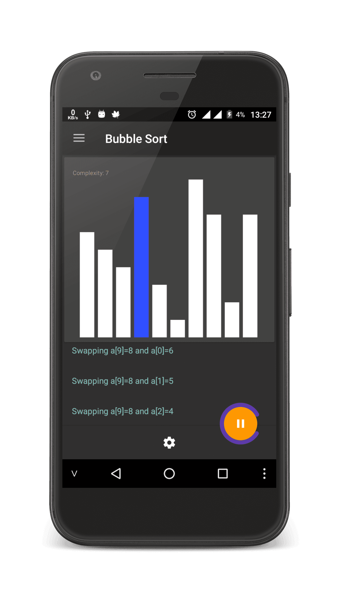
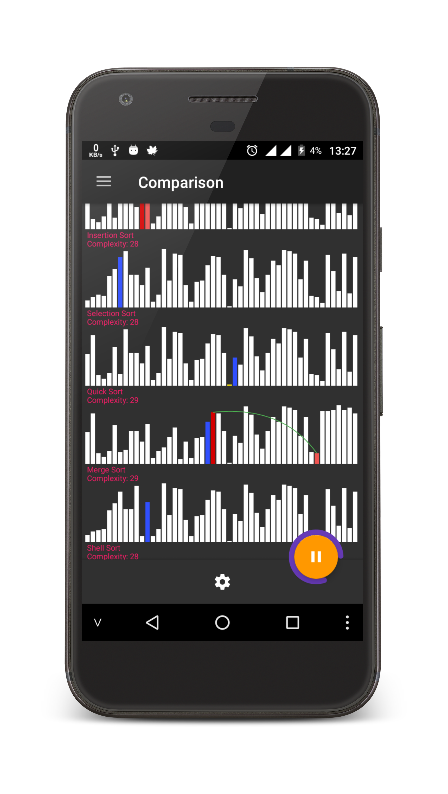
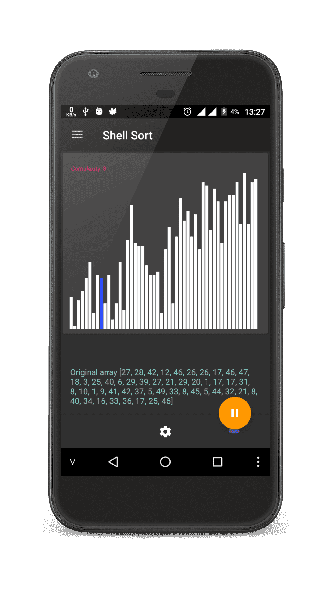
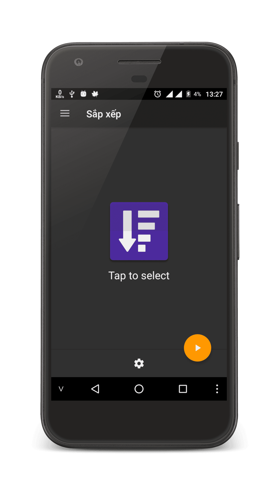

# Sort Algorithm
Visualization and comparison of sorting algorithms

You feel it difficult to understand the sort algorithm?
Sort Simulation app will help you to more easily visualize, simulate the application step by step operation of sorting algorithms.
The sorting algorithm is modeled:

- Bubble sort
- Insertion sort
- Selection sort
- Quick sort
- Shell sort
- Megre sort
- Cocktail sort
* It also compares the slow pace of the sorting algorithm
* Animate sort

There are 2 types of data entry (click the gear icon to open the control panel):
- Manual: enter the array to be sorted
- Auto: automatically generate random data

Some screenshot's

## License

    Copyright 2016 Tran Le Duy

    Licensed under the Apache License, Version 2.0 (the "License");
    you may not use this file except in compliance with the License.
    You may obtain a copy of the License at

       http://www.apache.org/licenses/LICENSE-2.0

    Unless required by applicable law or agreed to in writing, software
    distributed under the License is distributed on an "AS IS" BASIS,
    WITHOUT WARRANTIES OR CONDITIONS OF ANY KIND, either express or implied.
    See the License for the specific language governing permissions and
    limitations under the License.
